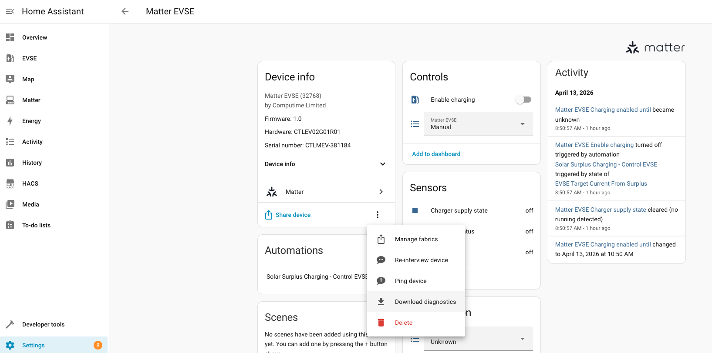

# EV Charger Matter Compulsory Cluster Test Guide

This document explains how to validate that a Matter EV Charger device meets all compulsory cluster requirements used by this repository.

## 1. Background And Purpose

When we onboard or evaluate a Matter EV Charger device, we want to confirm that the device exposes the minimum set of required Matter capabilities before we discuss Home Assistant entity coverage or automation behavior.

In this repository, that validation is driven by `desired.json`. The file lists the clusters, attributes, commands, and events that we currently treat as compulsory for the EV Charger test scope.

For convenience, you can also review the local example copies in the `docs` folder:

- [`docs/desired.json`](desired.json) for the current compulsory definition example
- [`docs/output_example.txt`](output_example.txt) for an example comparison output

The main goals of this check are:

- Verify that the device reports the expected Matter structure for the required EV Charger functionality.
- Detect gaps early, such as missing required attributes, missing command support, or incomplete endpoint exposure.
- Produce a repeatable result that can be compared across devices, firmware versions, and Matter server captures.
- Separate "device does not expose this Matter feature" from "Home Assistant does not map this feature yet".

At the moment, the compulsory scope in `desired.json` is centered on the EVSE-related clusters used in this project, including:

- `Descriptor`
- `BasicInformation`
- `EnergyEvse`
- `EnergyEvseMode`
- `PowerSource`
- `DeviceEnergyManagement`
- `DeviceEnergyManagementMode`

These compulsory items are currently based on the Matter 1.4.2 test scope used by this repository.

If the project scope changes, the device under test supports additional required features, or a newer Matter specification needs to be covered, update `desired.json` accordingly before running the comparison.

The comparison flow is mainly performed by `compare_desired_device.py`, which reads:

- the expected requirement set from `desired.json`
- a device JSON file containing Matter node data
- optional HA mapping data from `ha_mapping.json`

The output tells us which compulsory items are present and which are missing for the tested device.

Important limitation:

- A device JSON snapshot is usually reliable for attributes.
- Request commands can usually be checked from command list metadata in the snapshot.
- Response commands and events may need extra care depending on what the Matter server or HA diagnostics export includes.
- For that reason, the JSON-based check is the baseline, and logging-based confirmation may still be needed for some event-related conclusions.

## 2. How To Obtain The Device JSON

You need one JSON file for the target Matter EV Charger device. The comparison script accepts either:

- a Home Assistant Matter diagnostics JSON file
- a Matter node snapshot JSON file with `node_id` and `attributes`

### Option A: Download Diagnostics From Home Assistant

This is usually the easiest way to get a device JSON from the UI.

Steps:

1. Open Home Assistant.
2. Go to the Matter device page for the EV Charger.
3. Open the overflow menu on the device card.
4. Click `Download diagnostics`.
5. Save the downloaded JSON file into this repository, for example under the project root or under `matter_data/`.

Reference screenshot:



This diagnostics file is supported by `compare_desired_device.py` and can be used directly as input.

Notes:

- The diagnostics file is a good source for attributes and endpoint structure.
- Depending on the export content, it may not fully represent all command-response or event support.
- If event support is important, keep the Matter server logs as supporting evidence.

### Option B: Use An Existing Matter Snapshot JSON

If you already have a captured node snapshot, you can use that instead of downloading diagnostics again.

Accepted input shape includes a JSON object with:

- `node_id`
- `attributes`

Example sources in this repository include files such as:

- `matter_ev_charger.json`
- files under `matter_snapshots/`

These files are suitable when they contain the full node attribute map for the device being checked.

### Option C: Fetch A Fresh JSON Through `compare_desired_device.py`

If `python-matter-server` is running and reachable, the comparison script can fetch node data directly and write fresh JSON files before comparison.

Example:

```bash
python3 compare_desired_device.py --fetch-matter-server --node-id 81 --fetch-only
```

This writes fetched node JSON files into the output directory without running the full comparison.

Useful flags:

- `--matter-server-url` to point to a non-default websocket endpoint
- `--matter-timeout` to increase fetch timeout if needed

### Optional: Decode A Diagnostics File For Inspection

If you want to inspect the downloaded diagnostics JSON before comparison, use:

```bash
python3 decode_ha_matter_diagnostics.py /path/to/diagnostics.json --summary
```

This is helpful when you want to verify:

- the node ID
- which endpoints exist
- whether the file really belongs to the EV Charger you intend to test

### Recommended Practice

For a new EV Charger validation run, use this order:

1. Download the latest Home Assistant diagnostics JSON for the device.
2. Confirm the file belongs to the expected node and device.
3. Use that JSON as the baseline comparison input.
4. If you need to confirm events that are not clearly represented in the JSON, keep the Matter server event log together with the comparison result.

## 3. Compare `desired.json` With The Device JSON

After you obtain the device JSON, the next step is to compare it against `desired.json` by using `compare_desired_device.py`.

This script checks whether the target EV Charger exposes the compulsory Matter items defined in `desired.json`, including:

- required attributes
- required commands
- required events

It then writes comparison results that show which items are present and which items are missing.

You can use these example files while reading this section:

- [`docs/desired.json`](desired.json)
- [`docs/output_example.txt`](output_example.txt)

### Basic Command

If you already have one device JSON file, run:

```bash
python3 compare_desired_device.py --input-file /path/to/device.json
```

If your file is already in this repository, a typical example is:

```bash
python3 compare_desired_device.py --input-file matter_ev_charger.json
```

By default, the script uses:

- `desired.json` as the required cluster definition
- `ha_mapping.json` as the HA mapping reference
- `comparison_results/` as the output directory

### Compare A Directory Of JSON Files

If you want to scan a directory that contains multiple node JSON files, run:

```bash
python3 compare_desired_device.py --input-dir matter_snapshots
```

This is useful when you want to compare several captured devices in one run.

### Specify A Different Desired File Or Output Directory

If you want to point to a different requirement file or save results elsewhere, use:

```bash
python3 compare_desired_device.py \
  --desired desired.json \
  --input-file matter_ev_charger.json \
  --output-dir comparison_results
```

### Select Output Format

The script supports these output formats:

- `txt`
- `json`
- `csv`
- `both`

Example:

```bash
python3 compare_desired_device.py --input-file matter_ev_charger.json --format both
```

Recommended usage:

- use `txt` when you want a readable review summary
- use `csv` when you want to sort or filter results
- use `both` when you want both a human-readable report and a structured report

### What Files Will Be Generated

For each device, the script writes result files into the output directory.

Typical output filenames are:

- `device_<node_id>_result.txt`
- `device_<node_id>_result.json`
- `device_<node_id>_result.csv`

For example:

- `comparison_results/device_81_result.txt`
- `comparison_results/device_81_result.csv`

### How To Read The Result

The result is based on the compulsory items listed in `desired.json`.

Main meanings:

- `present` means the script found this required item in the device data.
- `missing` means the item is listed in `desired.json` but was not found in the device data used for the comparison.
- `Matter ready` in the CSV means the device side was detected as supporting that item.
- `HA ready` means the repository already has a Home Assistant mapping for that item.

When reviewing whether the EV Charger meets the compulsory cluster requirement, the primary focus is:

- whether all compulsory Matter items are marked as present
- whether there are any missing attributes, commands, or events

The example output in [`docs/output_example.txt`](output_example.txt) shows a real case where attributes and commands are detected from the device JSON, but some events still appear as missing in the comparison result.

### Recommended Review Workflow

For one EV Charger device, the usual process is:

1. Obtain the latest device JSON.
2. Run `compare_desired_device.py` against that JSON.
3. Open the generated `device_<node_id>_result.txt` file for a readable summary.
4. Open the generated `device_<node_id>_result.csv` file if you want to filter the results by cluster, type, or readiness.
5. Review all `missing` items and confirm whether they are true device gaps or limitations of the captured JSON.

### Important Interpretation Note

The comparison result is only as complete as the input JSON.

In practice:

- attributes are usually well represented in the device JSON
- request commands are often detectable from command list metadata
- response commands may depend on generated command list metadata
- events may require additional Matter server logging if the JSON snapshot does not fully expose event support

So if a required event appears as missing, treat that as "not confirmed by this JSON yet" until you also check the Matter server logs when needed.

### Confirm Events With Real Device Activity

As shown in [`docs/output_example.txt`](output_example.txt), required events may not always appear in the device JSON itself.

In that situation, do not conclude immediately that the device does not support the event. Instead, verify the event by exercising the real device and checking whether the expected Matter event is actually emitted.

Recommended process:

1. Run the EV Charger device in a real scenario.
2. Trigger the behavior that should produce the target event.
3. Collect or refresh the Matter server event log.
4. Check whether the expected device and expected event appear in `matter_data/matter_latest_node_events.txt`.

Examples of real triggers may include:

- plugging in the vehicle to trigger connection-related events
- starting charging to trigger charging-start events
- stopping charging to trigger charging-stop events
- presenting RFID credentials to trigger RFID-related events
- creating an error condition to trigger fault-related events

### Typical Trigger Method For Each `EnergyEvse` Event

The following guidance describes the usual real-world action that may trigger each compulsory `EnergyEvse` event.

#### `EVConnected` (`0x00`)

Typical meaning:

- the EVSE newly detects that a vehicle is connected

Typical trigger:

- plug the vehicle into the charger
- wait until the EVSE detects the cable connection and starts a session

Expected observation:

- the Matter event log should show `EnergyEvse.Events.EVConnected(...)`

#### `EVNotDetected` (`0x01`)

Typical meaning:

- the EVSE no longer detects the vehicle after a connected or active session

Typical trigger:

- unplug the vehicle after it was previously connected
- end the session and wait until the EVSE returns to a no-vehicle-detected state

Expected observation:

- the Matter event log should show `EnergyEvse.Events.EVNotDetected(...)`

#### `EnergyTransferStarted` (`0x02`)

Typical meaning:

- actual energy transfer has started, not just cable insertion

Typical trigger:

- connect the vehicle
- ensure charging is enabled on the EVSE
- ensure the vehicle requests charging current
- wait until real charging current begins flowing

Expected observation:

- the Matter event log should show `EnergyEvse.Events.EnergyTransferStarted(...)`

#### `EnergyTransferStopped` (`0x03`)

Typical meaning:

- energy transfer was in progress and has now stopped

Typical trigger:

- stop charging from the EVSE side
- stop charging from the vehicle side
- disable charging through Home Assistant or another controller while charging is active

Expected observation:

- the Matter event log should show `EnergyEvse.Events.EnergyTransferStopped(...)`
- the event may also include a stop reason such as EV stopped or EVSE stopped

#### `Fault` (`0x04`)

Typical meaning:

- the EVSE fault state changed from one state to another

Typical trigger:

- use a vendor-provided diagnostic or test mode if available
- use a safe lab validation method to simulate a supported charger fault condition

Expected observation:

- the Matter event log should show `EnergyEvse.Events.Fault(...)`

Important note:

- this event is usually harder and riskier to validate on real hardware
- do not try to create unsafe electrical fault conditions on a production device

#### `RFID` (`0x05`)

Typical meaning:

- the EVSE read an RFID credential or card token

Typical trigger:

- present a supported RFID card or token to the EVSE reader
- if available, also test with a second card to confirm repeated detection behavior

Expected observation:

- the Matter event log should show `EnergyEvse.Events.Rfid(...)`

### Suggested Test Order

If you want to validate the events in a practical sequence, a common order is:

1. Present RFID if the device requires authorization before charging.
2. Plug in the vehicle and check for `EVConnected`.
3. Start charging and check for `EnergyTransferStarted`.
4. Stop charging and check for `EnergyTransferStopped`.
5. Unplug the vehicle and check for `EVNotDetected`.
6. Validate `Fault` separately with a controlled and safe test method.

When checking `matter_data/matter_latest_node_events.txt`, confirm all of the following:

- the `node_id` matches the device under test
- the `endpoint_id` matches the expected EVSE endpoint
- the `cluster_id` matches the cluster from `desired.json`
- the `event_id` matches the compulsory event you want to confirm

Only after the expected event has been successfully triggered and observed in the Matter server log should it be treated as confirmed for that test run.
